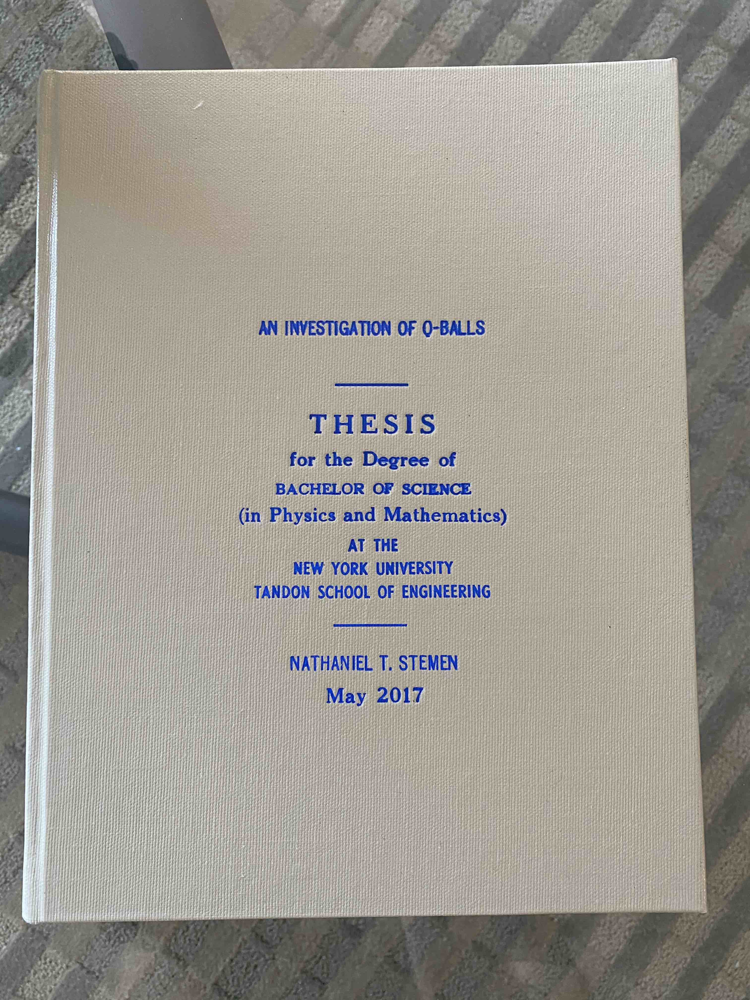

# Abstract

In this thesis we study the dynamics of a complex scalar field with a nonrenormalizable potential. In particular we study the existence of the non-topological soliton solutions known as Q-Balls. These objects have been proposed as candidates to solve the present baryon asymmetry, and arise in supersymmetric theories, as well as abelian gauge theories, non-abelian gauge theories, non-commutative complex scalar field theories, etc. Formulating the existence problem using constrained minimization allows for this approach to translate easily into the numerical work that follows. With this framework the computation of soliton profiles, along with the associated angular momentum parameter are achieved. To best understand the work, we present the prerequisite classical field theory and an introduction to Q-Balls and Q-Vortex solitons.

## What's this all about

So I wrote and submitted my undergraduate thesis in the spring semester of 2017, but I'm just now putting it online. When I was writing it I would have loved to have come across other undergraduate theses to kind of use as a basis or just provide some expectations of the level at which they typically are (not that they can't vary).

Also the nyu-tandon(/poly) thesis template isn't even online, so if anyone needs it they can not get it from here and just delete all my stuff :).

## Printing

In order to graduate I also had to get physical copies of the thesis printed. I printed four copies in the university library, and took them to [Henry Bookbinding Co](https://www.yelp.com/biz/henry-bookbinding-new-york) to get them bound. The guy there (presumably Henry?) is absolutely amazing, and has an amazing workshop. I think I paid $50 for each copy (which the university nor department would cover) and gave them to

1. University Library
2. My thesis advisor
3. My parents

After getting them all signed by Prof. Luciano Medina. Here's what the final copies looked like.

If I got to choose, I would have printed it on smaller paper so it was a bit thicker, and less cumbersome to hold/carry. Maybe next time.
